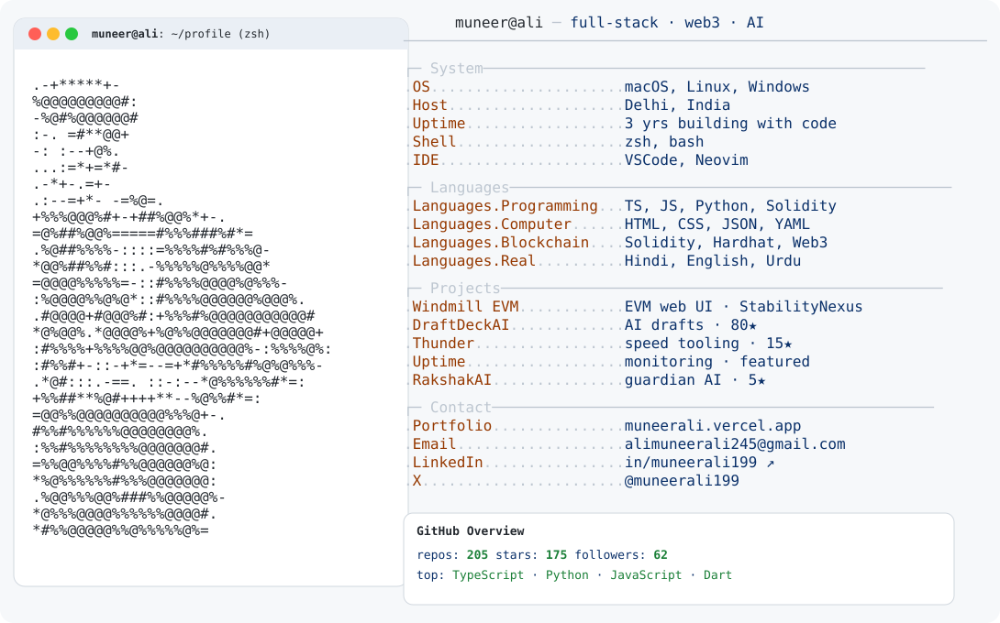

  <a href="https://github.com/Muneerali199">
    <picture>
      <source media="(prefers-color-scheme: dark)" srcset="./assets/dark_mode.svg">
      
    </picture>
  </a>

  I build thoughtful interfaces, useful developer tools, and Web3 products—from the first sketch to a shipped experience.

  <a href="https://muneerali.vercel.app/">Portfolio</a>
  · <a href="https://www.linkedin.com/in/muneerali199">LinkedIn</a>
  · <a href="https://x.com/muneerali199">X</a>
  · <a href="mailto:alimuneerali245@gmail.com">Email</a>

## Currently

- Building modern full-stack experiences with React, Next.js, TypeScript, and Node.js.
- Exploring Solidity, DeFi, AI, and developer tooling.
- Contributing to open source with [AOSSIE](https://github.com/AOSSIE-Org).

## Selected work

| Project | Link |
| --- | --- |
| Windmill EVM WebUI | [Explore →](https://github.com/StabilityNexus/Windmill-EVM-WebUI) |
| DraftDeckAI | [Explore →](https://github.com/Muneerali199/Draftdeckai) |
| Thunder | [Explore →](https://github.com/Muneerali199/thunder) |
| Uptime | [Explore →](https://github.com/Muneerali199/uptime) |

## Toolbox

  

  
  

Designed and built by Muneer Ali.

