<!-- ANIMATED LOGO -->
<div align="center">
  
</div>

<!-- TYPING -->
<div align="center">

[](https://git.io/typing-svg)

</div>

<div align="center">

<a href="https://github.com/Muneerali199?tab=followers"></a>

<a href="https://muneerali.vercel.app"></a>

</div>

<br/>

## About

```ts
const muneer = {
  location:   "Delhi, India",
  stack:      "React · Next.js · Node.js · TypeScript · MongoDB",
  blockchain: "Solidity · Smart Contracts · DeFi · Web3",
  ai:         "LLMs · Computer Vision · Intelligent Agents",
  oss:        "Active contributor @ AOSSIE & more",
  contact:    "alimuneerali245@gmail.com",
};
```

<br/>

## Tech Stack

<div align="center">
<table>
<tr><td align="center" width="96">
<a href="#">

</a>
<br><sub><b>TypeScript</b></sub>
</td>
<td align="center" width="96">
<a href="#">

</a>
<br><sub><b>JavaScript</b></sub>
</td>
<td align="center" width="96">
<a href="#">

</a>
<br><sub><b>Python</b></sub>
</td>
<td align="center" width="96">
<a href="#">

</a>
<br><sub><b>Java</b></sub>
</td>
<td align="center" width="96">
<a href="#">

</a>
<br><sub><b>C++</b></sub>
</td>
<td align="center" width="96">
<a href="#">

</a>
<br><sub><b>Dart</b></sub>
</td>
<td align="center" width="96">
<a href="#">

</a>
<br><sub><b>React</b></sub>
</td>
<td align="center" width="96">
<a href="#">

</a>
<br><sub><b>Next.js</b></sub>
</td></tr>
<tr><td align="center" width="96">
<a href="#">

</a>
<br><sub><b>Node.js</b></sub>
</td>
<td align="center" width="96">
<a href="#">

</a>
<br><sub><b>Express</b></sub>
</td>
<td align="center" width="96">
<a href="#">

</a>
<br><sub><b>MongoDB</b></sub>
</td>
<td align="center" width="96">
<a href="#">

</a>
<br><sub><b>Tailwind</b></sub>
</td>
<td align="center" width="96">
<a href="#">

</a>
<br><sub><b>Docker</b></sub>
</td>
<td align="center" width="96">
<a href="#">

</a>
<br><sub><b>Firebase</b></sub>
</td>
<td align="center" width="96">
<a href="#">

</a>
<br><sub><b>Solidity</b></sub>
</td>
<td align="center" width="96">
<a href="#">

</a>
<br><sub><b>TensorFlow</b></sub>
</td></tr>
<tr><td align="center" width="96">
<a href="#">

</a>
<br><sub><b>Git</b></sub>
</td>
<td align="center" width="96">
<a href="#">

</a>
<br><sub><b>GCP</b></sub>
</td>
<td align="center" width="96">
<a href="#">

</a>
<br><sub><b>Figma</b></sub>
</td>
<td align="center" width="96">
<a href="#">

</a>
<br><sub><b>VS Code</b></sub>
</td>
<td align="center" width="96">
<a href="#">

</a>
<br><sub><b>HTML</b></sub>
</td>
<td align="center" width="96">
<a href="#">

</a>
<br><sub><b>CSS</b></sub>
</td>
<td align="center" width="96">
<a href="#">

</a>
<br><sub><b>Vite</b></sub>
</td>
<td align="center" width="96">
<a href="#">

</a>
<br><sub><b>Linux</b></sub>
</td></tr>
</table>
</div>

<br/>

## GitHub Stats

<div align="center">


</div>

<br/>

## Projects

<div align="center">

[](https://github.com/Muneerali199/Draftdeckai)
[](https://github.com/Muneerali199/thunder)
[](https://github.com/Muneerali199/uptime)

</div>

<br/>

## Activity


## Contribution Snake

<div align="center">
<picture>
  <source media="(prefers-color-scheme: dark)"  srcset="https://raw.githubusercontent.com/Muneerali199/Muneerali199/output/github-contribution-grid-snake-dark.svg"/>
  <source media="(prefers-color-scheme: light)" srcset="https://raw.githubusercontent.com/Muneerali199/Muneerali199/output/github-contribution-grid-snake.svg"/>
  
</picture>
</div>

<br/>

## Now Playing

<div align="center">

[](https://open.spotify.com/user/31tpqnoarhpaxxz7226elu4w4muy)

</div>

## Connect

<div align="center">

[](https://muneerali.vercel.app/)
[](https://linkedin.com/in/muneerali199)
[](https://twitter.com/muneerali199)
[](https://discord.gg/Muneerali199)
[](https://instagram.com/muneer.xyz)
[](https://leetcode.com/u/muneerali199/)

</div>

<br/>


